权限控制与管理

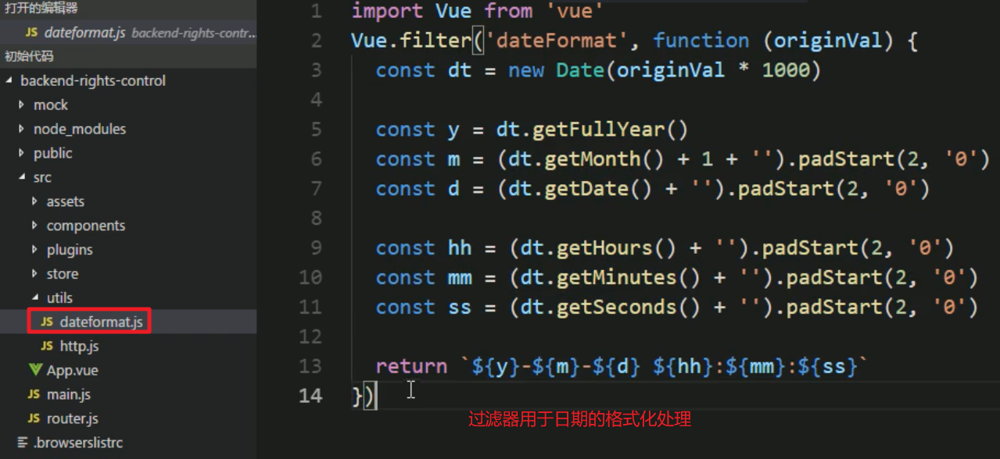

## 菜单的控制  

**vuex中的数据可以在多个组件中使用**

向vuex中添加数据

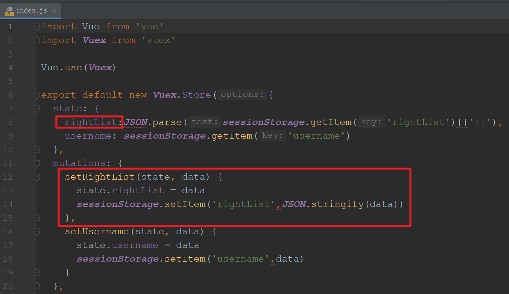

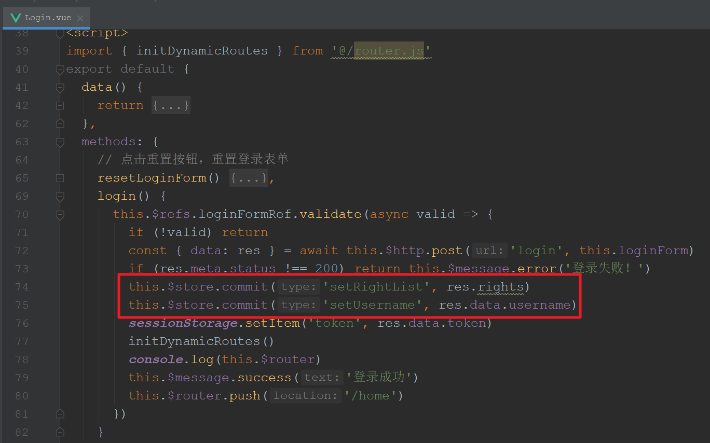


从vuex中读入数据

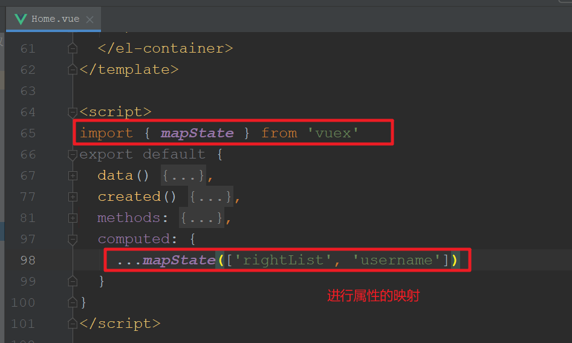

---

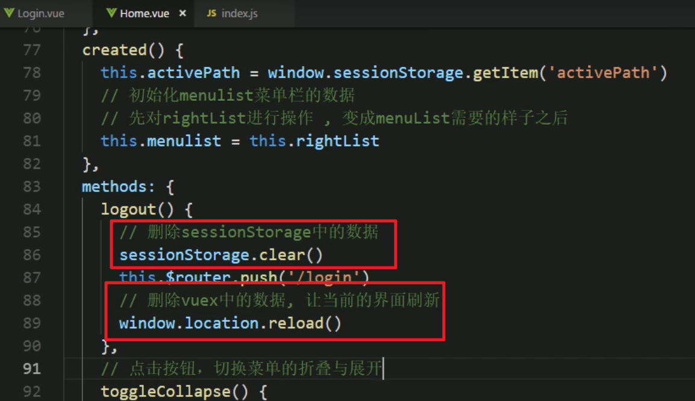

---

## 界⾯的控制  

如何判断是否登录  

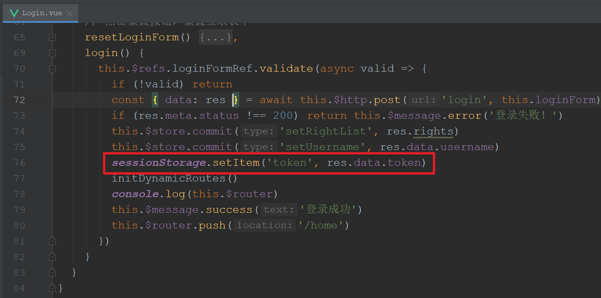

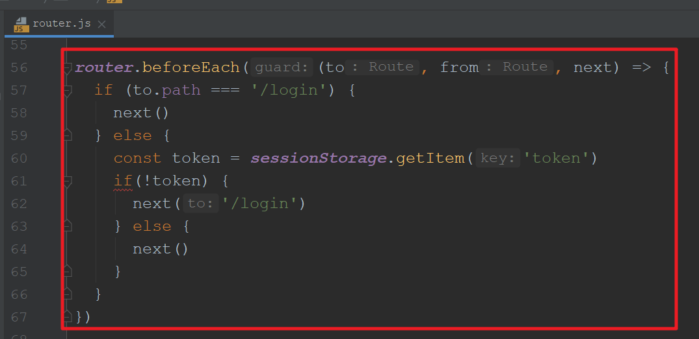

---

动态路由

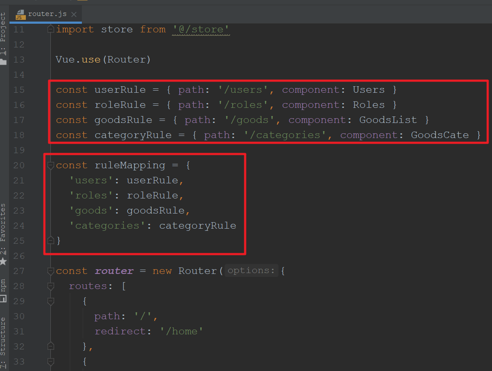

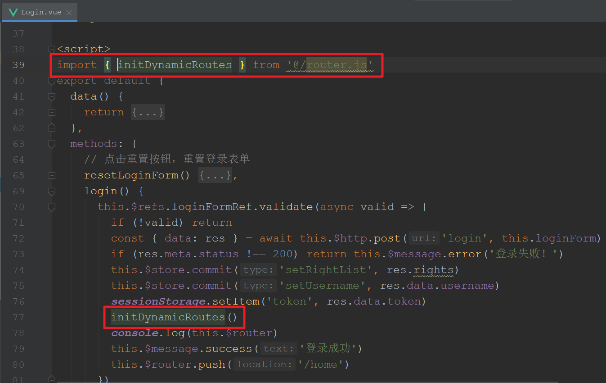

> 这个地方有个bug，再次刷新页面，路由将失效

解决：

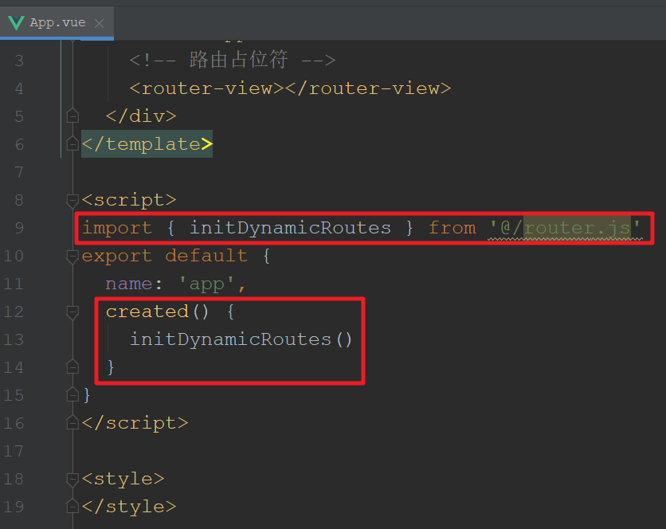

---

## 按钮的控制  

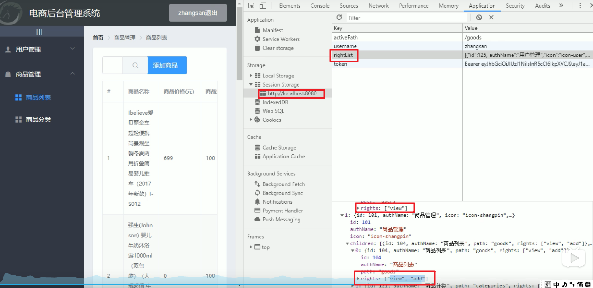


使用自定义指令

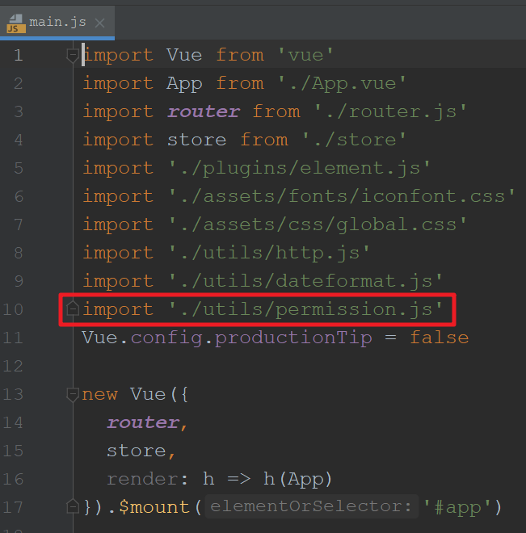

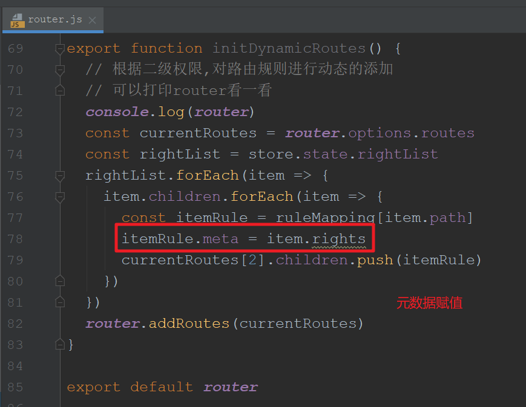

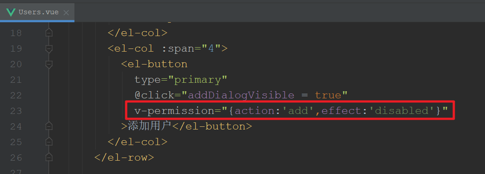

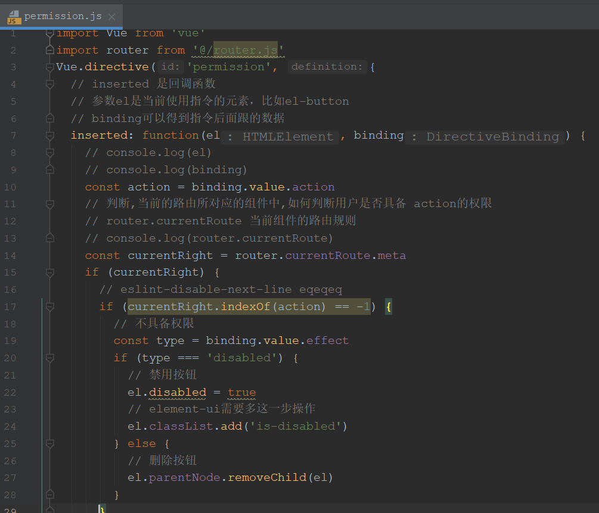

---

## 请求和响应的控制  

`http.js`

```js
import axios from 'axios'
import Vue from 'vue'
import router from '../router'
// 配置请求的跟路径, 目前用mock模拟数据, 所以暂时把这一项注释起来
// axios.defaults.baseURL = 'http://127.0.0.1:8888/api/private/v1/'
const actionMapping = {
  get: 'view',
  post: 'add',
  put: 'edit',
  delete: 'delete'
}
axios.interceptors.request.use(function(req){
  const currentUrl = req.url
  if (currentUrl !== 'login') {
    // 不是登录的请求,我们应该在请求头中,加入 token数据
    req.headers.Authorization = sessionStorage.getItem('token')
    // 当前模块中具备的权限
    // 查看用户  get请求
    // 增加用户  post请求
    // 修改用户  put请求
    // 删除用户  delete请求
    const method = req.method
    // 根据请求, 得到是哪种操作
    const action = actionMapping[method]
    // 判断action是否存在当前路由的权限中
    const rights = router.currentRoute.meta
    // eslint-disable-next-line eqeqeq
    if (rights && rights.indexOf(action) == -1) {
      // 没有权限
      alert('没有权限')
      return Promise.reject(new Error('没有权限'))
    }
  }
  return req
})
axios.interceptors.response.use(function(res) {
  if (res.data.meta.status === 401) {
    router.push('/login')
    sessionStorage.clear()
    window.location.reload()
  }
  return res
})
Vue.prototype.$http = axios

```

